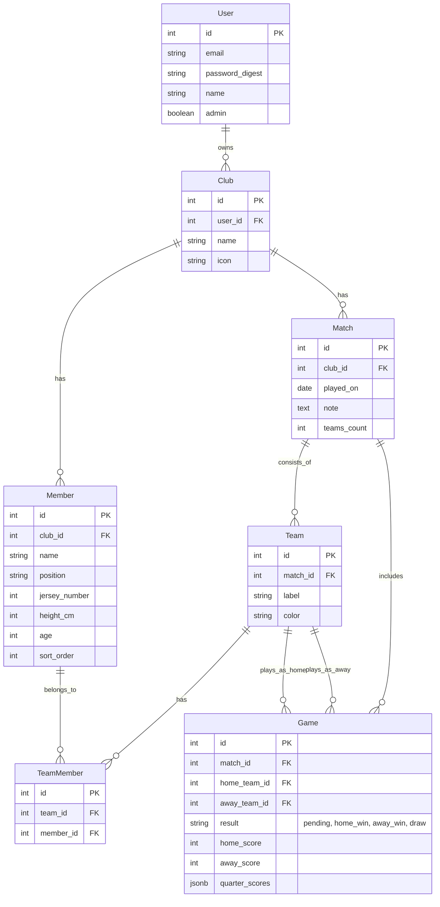

# Database Structure

## ER Diagram

## Tables

### Users
시스템 사용자 정보

| Column | Type | Description |
|--------|------|-------------|
| id | integer | Primary Key |
| email | string | 이메일 (로그인 ID) |
| password_digest | string | 암호화된 비밀번호 |
| name | string | 사용자 이름 |
| admin | boolean | 관리자 여부 (default: false) |

### Clubs
농구 동호회/클럽 정보

| Column | Type | Description |
|--------|------|-------------|
| id | integer | Primary Key |
| user_id | integer | Foreign Key (Users) |
| name | string | 클럽 이름 |
| icon | string | 클럽 아이콘 |

### Members
클럽에 소속된 선수 정보

| Column | Type | Description |
|--------|------|-------------|
| id | integer | Primary Key |
| club_id | integer | Foreign Key (Clubs) |
| name | string | 선수 이름 |
| position | string | 포지션 (PG, SG, SF, PF, C) |
| jersey_number | integer | 등번호 |
| height_cm | integer | 키 (cm) |
| age | integer | 나이 |
| sort_order | integer | 정렬 순서 |

### Matches
경기(매치) 정보 (하루 동안 진행되는 경기 모임)

| Column | Type | Description |
|--------|------|-------------|
| id | integer | Primary Key |
| club_id | integer | Foreign Key (Clubs) |
| played_on | date | 경기 날짜 |
| note | text | 메모 |
| teams_count | integer | 참가 팀 수 (2 or 3) |

### Teams
매치에 참가하는 팀 정보 (예: 팀 A, 팀 B)

| Column | Type | Description |
|--------|------|-------------|
| id | integer | Primary Key |
| match_id | integer | Foreign Key (Matches) |
| label | string | 팀 라벨 (A, B, C...) |
| color | string | 팀 색상 (White, Black, Red...) |

### TeamMembers
팀과 선수의 관계 (N:M)

| Column | Type | Description |
|--------|------|-------------|
| id | integer | Primary Key |
| team_id | integer | Foreign Key (Teams) |
| member_id | integer | Foreign Key (Members) |

### Games
매치 내의 개별 게임 정보 (예: A vs B)

| Column | Type | Description |
|--------|------|-------------|
| id | integer | Primary Key |
| match_id | integer | Foreign Key (Matches) |
| home_team_id | integer | Foreign Key (Teams) |
| away_team_id | integer | Foreign Key (Teams) |
| result | string | 경기 결과 (pending, home_win, away_win, draw) |
| home_score | integer | 홈팀 최종 점수 (default: 0) |
| away_score | integer | 어웨이팀 최종 점수 (default: 0) |
| quarter_scores* | json | 쿼터별 점수 기록 (예: `{"1": {"home": 10, "away": 12}}`) |

* `quarter_scores` 컬럼은 JSONB 형태로 저장되며, 각 쿼터별 상세 점수를 기록합니다.
